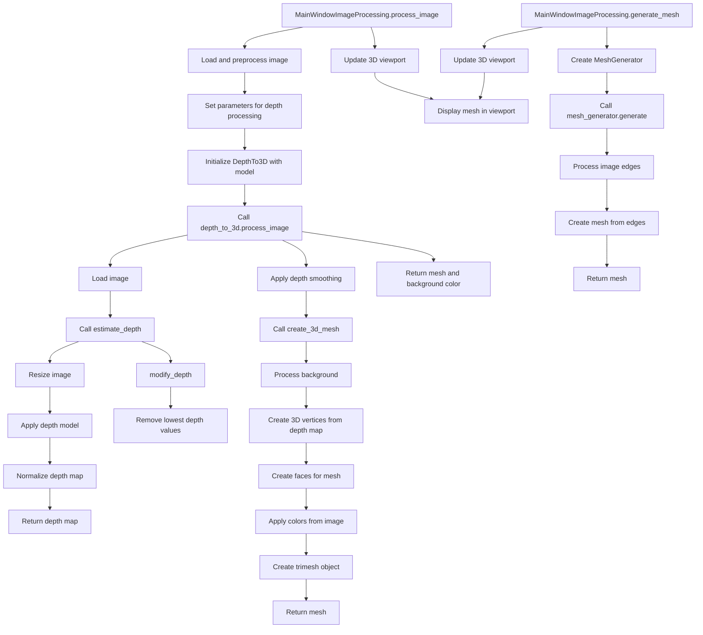

# 3D Mesh Creation Flow

This document outlines the logical flow for creating a 3D mesh in EdgeMesh, starting from the main window's `process_image` method.

## Overview

The process of creating a 3D mesh from an image involves several steps:
1. Loading and preprocessing the image
2. Estimating depth from the image
3. Creating a 3D mesh from the depth map
4. Displaying the mesh in a 3D viewport

## Flow Diagram

## Detailed Process

### 1. MainWindowImageProcessing.process_image
- Entry point for 3D mesh creation
- Validates input parameters (resolution, depth_amount, max_depth)
- Gets smoothing method and model type
- Initializes DepthTo3D with selected model
- Calls depth_to_3d.process_image with parameters
- Updates 3D viewport with the resulting mesh

### 2. DepthTo3D.process_image
- Loads the image
- Estimates depth using the selected model
- Modifies depth values based on parameters
- Applies depth smoothing
- Creates a 3D mesh from the depth map
- Returns the mesh and background color

### 3. DepthTo3D.estimate_depth
- Resizes the image to ensure divisibility by 32
- Applies the selected depth estimation model
- Normalizes the depth map
- Returns the depth map

### 4. DepthTo3D.create_3d_mesh
- Processes the background (optional removal)
- Creates 3D vertices from the depth map
- Creates faces for the mesh
- Applies colors from the original image
- Creates a trimesh object
- Returns the mesh

### 5. MainWindowImageProcessing.update_3d_viewport
- Creates or updates the 3D viewport
- Sets the background color
- Loads the mesh into the viewport
- Displays the mesh

### Alternative Flow: 2D Mesh Generation

The application also supports generating a mesh from 2D image edges:

### 1. MainWindowImageProcessing.generate_mesh
- Creates a MeshGenerator with visualization options
- Calls mesh_generator.generate with the processed image
- Updates the 3D viewport with the resulting mesh

### 2. MeshGenerator.generate
- Processes the image edges
- Creates a mesh from the edges
- Returns the mesh

## Conclusion

The 3D mesh creation process in EdgeMesh involves multiple steps and components working together to transform a 2D image into a 3D mesh. The process starts with the main window's process_image method and flows through depth estimation, mesh creation, and finally display in a 3D viewport.